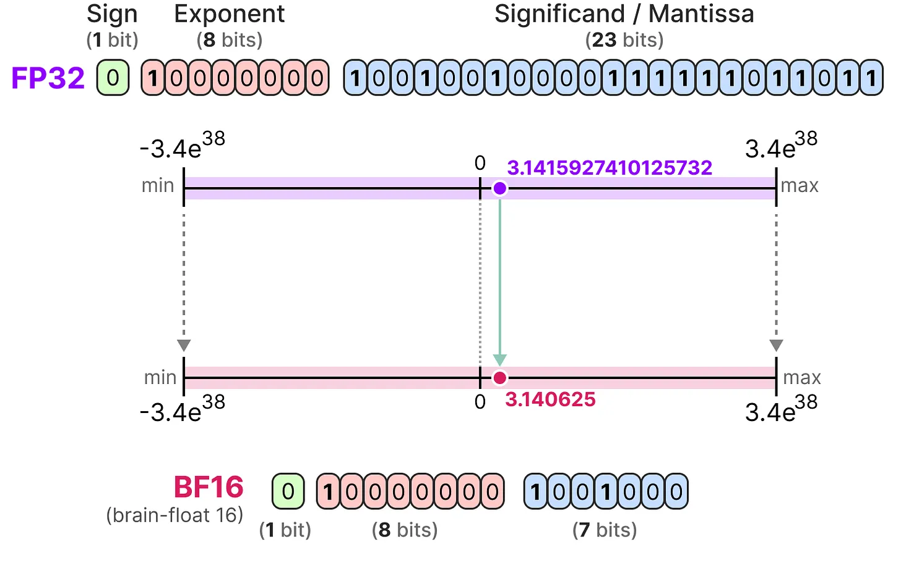

# # Fine-Tuning Large Language Models (LLMs)

In the rapidly evolving world of AI, fine-tuning large language models (LLMs) has emerged as a powerful technique to adapt general-purpose models to specialized tasks, domains, and preferences. Whether you're building a legal document assistant, customizing a chatbot's personality, or optimizing model performance on enterprise workflows, fine-tuning unlocks a new level of control, precision, and efficiency.

Fine-tuning allows you to go beyond prompt engineering. It's about *teaching* the model to behave, reason, and respond the way you want—on your data, for your use case.

Let’s walk through why, when, and how you might choose to fine-tune an LLM, and how this repository can help you get started.

---

## Use Cases of Fine-Tuning

- **Add New Knowledge**
  - Medical
  - Legal
  - Industrial

- **Inject Domain-Specific Knowledge**

- **Improve Performance on Tasks**
  - Storytelling
  - Document classification
  - Information extraction
  - Summarization

- **Give Assistants a Personality**
  - More engaging, fun, or human-like interactions

- **Improve Usability of Local Models**
  - Fine-tuning helps overcome model limitations like generic behavior or weak task performance

- **Overcome Guardrails**
  - Bypass political bias
  - Respond to potentially dangerous prompts responsibly

---

## Fine-Tuning vs Prompting

### Fine-Tuning
- Needs more high-quality data
- Has an upfront compute cost
- Requires some technical knowledge
- Can learn from large datasets and user behavior signals
- Long-term cost-effective (especially for small models)

### Prompting
- Works with little or no data
- Has smaller upfront cost
- Requires no technical setup
- Good for quick prototyping or testing behavior

### Drawbacks of Prompting
- Fits much less data
- Can forget context
- Higher risk of hallucination

---

## Fine-Tuning vs RAG

Use **RAG** when the knowledge base changes frequently.

### RAG Advantages
- Integrates dynamic knowledge
- No training or retraining needed
- More accurate when retrieval is high-quality
- Reduces hallucinations

### RAG Disadvantages
- Slower (retrieval + generation)
- Lower performance on narrow, specific tasks
- Doesn’t modify response behavior

---

## Training Methods

### 1. Full Fine-Tuning
- Retrains all parameters
- Expensive and risks catastrophic forgetting

### 2. Transfer Learning
- Freeze most layers
- Fine-tune only the last few layers

### 3. Parameter Efficient Fine-Tuning (PEFT)
- Freeze all model weights
- Inject and train a small set of parameters (e.g., LoRA)

---

## LoRA vs QLoRA

- **LoRA:** Fine-tunes small matrices in 16-bit without updating full weights
- **QLoRA:** LoRA + 4-bit quantization → fits larger models with minimal hardware

---

## Important Configuration Settings

```python
bnb_config = BitsAndBytesConfig(
    load_in_4bit=True,
    bnb_4bit_use_double_quant=True,
    bnb_4bit_quant_type="nf4",
    bnb_4bit_compute_dtype=torch.bfloat16
)
```

- `max_seq_length = 2048`: Default for testing; Unsloth allows longer contexts
- `dtype = None`: Use `torch.float16` or `torch.bfloat16` on newer GPUs
- `load_in_4bit = True`: Saves memory (ideal for 16GB GPUs)
- `full_finetuning = True`: Enables full weight updates
- `load_in_8bit = True`: Alternative to 4-bit for mid-range GPUs

---

## Quantization

Reduces model precision to save memory and speed up training.

### FP16 (Half Precision)
- From 32-bit to 16-bit floats


### BF16 (bfloat16)
- Truncated version of FP32 to preserve range with reduced precision

---

## Fine-Tuning Parameters

### `per_device_train_batch_size`
- Samples processed on **each GPU per step**
- Higher values = better utilization, more memory use

### `gradient_accumulation_steps`
- Simulates large batch sizes without more memory
- Accumulates gradients before optimizer step

### Gradient Checkpointing
- Saves memory by **recomputing forward pass during backward**
- Enables:
  - Larger models
  - Bigger batches
- Slows training slightly


